# 🧔 Der Grosse Zwerg 🐉

> [!NOTE]
> ### 🎮 Direkt spielen: [gsb-deleven.github.io/Game-Der_Grosse_Zwerg](https://gsb-deleven.github.io/Game-Der_Grosse_Zwerg/)
> Läuft im Browser auf **PC, Tablet und Handy**. Auf dem Tablet: Seite öffnen, «Zum Home-Bildschirm», dann startet es wie eine App.
>
> | | 💻 PC / Laptop | 📱 Tablet / Handy |
> |---|---|---|
> | Laufen | Pfeiltasten, W A S D oder Controller | Steuerkreuz oder einfach **hintippen** |
> | Helfen / Reden | Leertaste, Enter, E oder A-Knopf | grosser **Herz-Knopf** oder Figur antippen |
> | Menü | **Esc** / P / Start | ⏸ oben rechts |
> | Vollbild | **F** | im Menü |
> | Spielstände | 3 Plätze, speichert automatisch | gleich |

### Ein Retro-Abenteuer über Mut, Freundschaft und ein grosses Herz. Im Stil von Zelda und Secret of Mana, für Kinder ab 3 Jahren.

[](https://gsb-deleven.github.io/Game-Der_Grosse_Zwerg/)
[](https://github.com/GSB-Deleven/Game-Der_Grosse_Zwerg/wiki)
[](https://github.com/GSB-Deleven/Game-Der_Grosse_Zwerg/discussions)
[](https://github.com/GSB-Deleven/Game-Der_Grosse_Zwerg/issues)

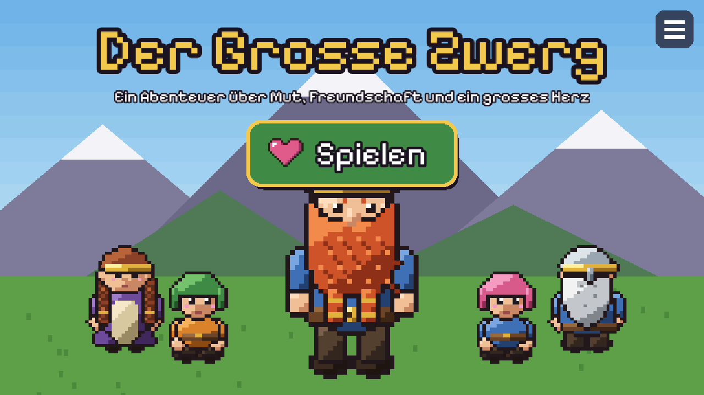

---

## 📖 Worum geht's?

> Es war einmal ein Zwerg, der war viel, viel grösser als alle anderen Zwerge im Dorf.
> Manche lachten über ihn: «Du bist doch gar kein Zwerg!» Aber er hatte ein riesengrosses Herz
> und half allen, wo er nur konnte.
>
> Eines Tages rief die Königin um Hilfe: Auf dem höchsten Berg wohnte ein Drache, und alle hatten Angst.
> Der Grosse Zwerg machte sich auf den Weg, über Seen, durch tiefe Täler und dunkle Wälder, hinauf auf den höchsten Berg.
> Und dort fand er einen ganz besonderen Weg: **Freundschaft statt Kampf.**

Das Spiel ist aus Papas Gute-Nacht-Geschichte entstanden. Die Aufgaben im Dorf hat sich **Liv** gewünscht:
Essen für Mama und die Kinder, Wasser holen, Bücher vom höchsten Regal und Äpfel von ganz oben am Baum.

---

## 💛 Gemacht für kleine Kinder

| | |
|---|---|
| 🕊️ **Kein Kampf** | Niemand wird gehauen. Sogar der Drache wird mit Freundschaft «bezwungen». |
| 🌈 **Kein Game Over** | Man kann nichts falsch machen und nichts verlieren. Es gibt keinen Zeitdruck. |
| 🖼️ **Ohne Lesen spielbar** | Wünsche erscheinen als Bild in einer Sprechblase, und ein **gelber Pfeil** zeigt immer, wohin es geht. |
| 👆 **Einfach zu steuern** | Auf dem Tablet reicht Hintippen: Der Zwerg läuft selbst hin und hilft. |
| 💾 **Drei Spielstände** | z. B. einer für Liv, einer für den kleinen Bruder und einer für Papa |
| ⭐ **Grosse Momente** | Bei coolen Stellen gibt es eine grosse Einblendung mit Musik und Sternen. |

---

## 🕹️ So wird gespielt

**1. Wer spielt?** 💾
Einen der drei Speicherplätze wählen und einen Namen eingeben. Das Spiel speichert von selbst.

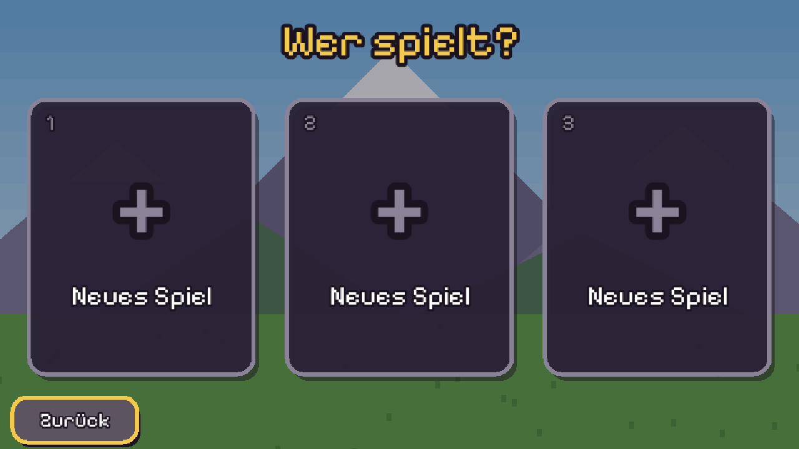

**2. Wünsche erfüllen** 💭
Über den Köpfen der Zwerge steht, was sie brauchen. Der Grosse Zwerg holt es und bringt es hin. Für jede Hilfe gibt es ein Herz.

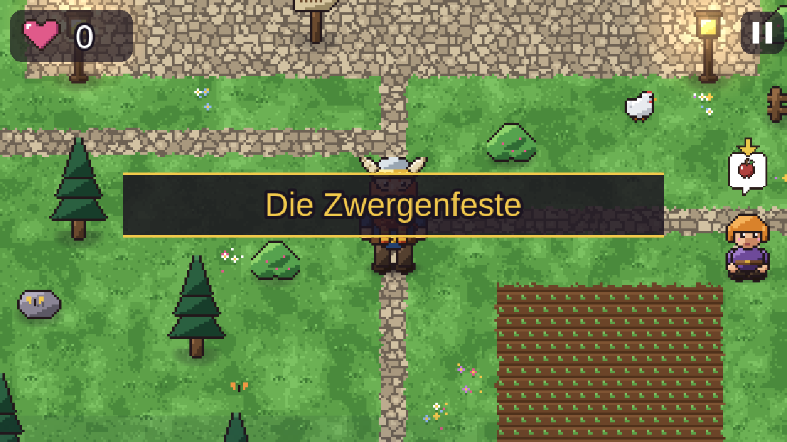

**3. Dem Pfeil folgen** ➡️
Wer nicht weiter weiss, folgt einfach dem gelben Pfeil. Er zeigt zum nächsten Wunsch oder zum Ausgang.

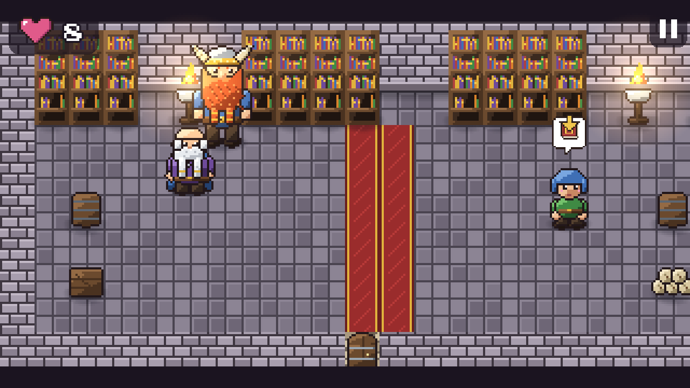

**4. Grosse Momente** ⭐
Wenn etwas Besonderes passiert, gibt es eine Einblendung über den ganzen Bildschirm.

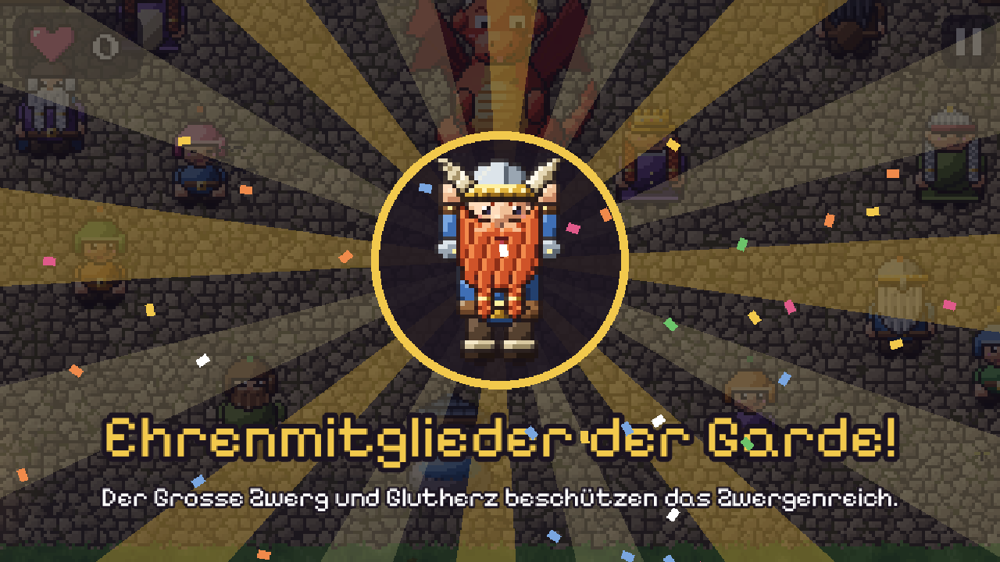

---

## 🗺️ Fünf Kapitel, elf Orte

| Kapitel | Orte | Was passiert |
|---|---|---|
| 1️⃣ **Die Zwergenfeste** | Dorf, Runen-Bibliothek | Essen, Wasser, Äpfel und Bücher: Der Grosse Zwerg hilft allen. Die frechen Kinder werden Freunde, und der Bote der Königin kommt. |
| 2️⃣ **Der Ruf der Königin** | Burghof, Thronsaal | Pony Flocke hat Hunger, die Rosen haben Durst. Königin Brunhild erzählt vom Drachen. |
| 3️⃣ **Die grosse Reise** | See, Tal, Wald, Berg | Trittsteine über den See, eine Brücke übers Tal, Glühwürmchen im dunklen Wald, eine Strickleiter und Mut für die ängstlichen Zwerge |
| 4️⃣ **Der Drache** | Gipfel, Höhle | Die Fackel geht aus, zwei leuchtende Augen … *«Halt, lieber Drache, ich will dir nichts tun!»* Glutherz wird ein Freund. |
| 5️⃣ **Der Flug und das Fest** | Flug, Marktplatz | Auf Glutherz über das ganze Reich bis zum Schloss. Die Königin ernennt beide zu Ehrenmitgliedern der Garde. |

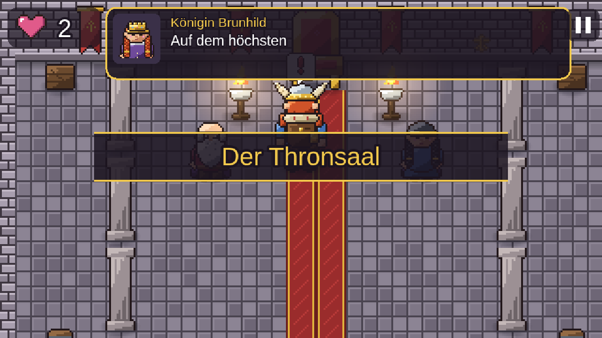

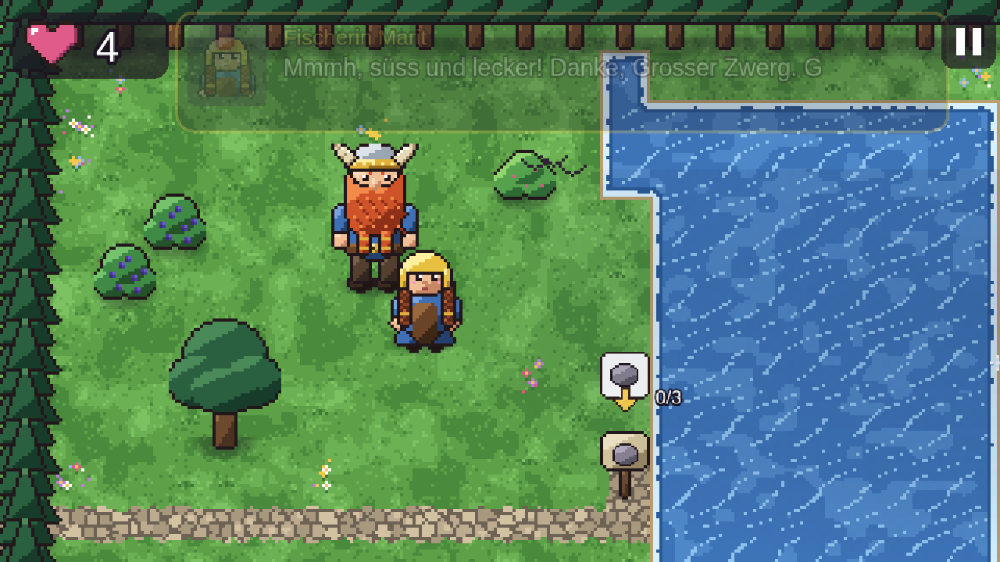

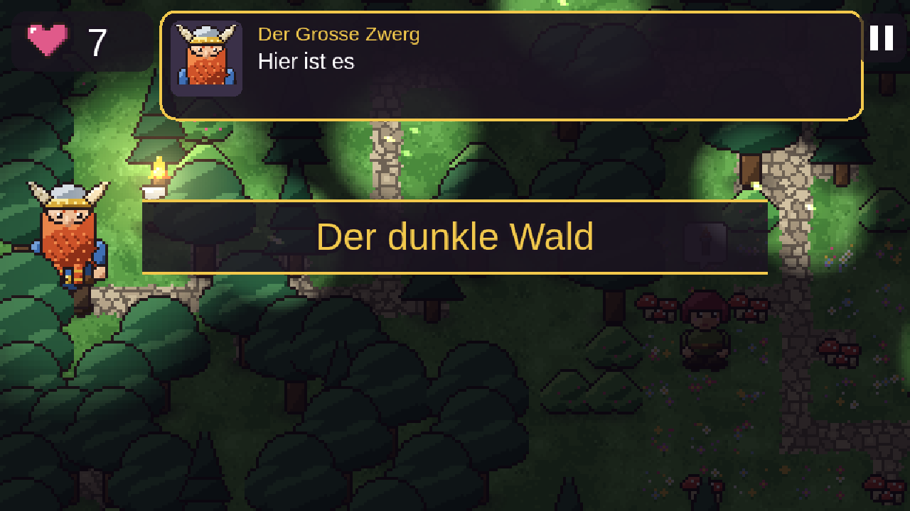

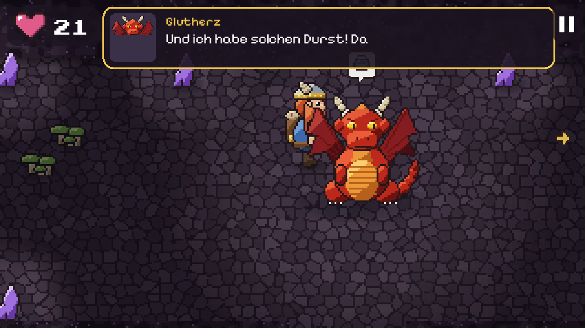

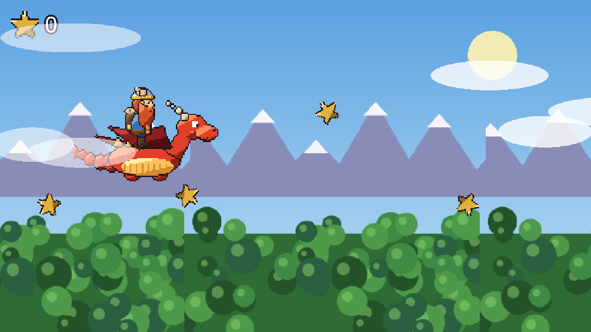

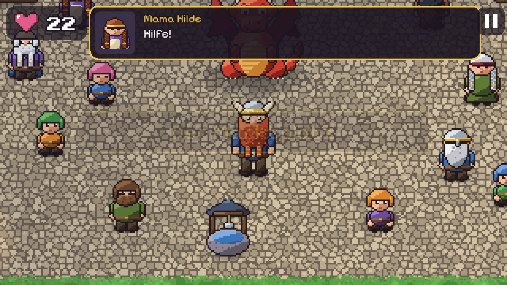

---

## ⭐ Was alles drin ist

🧔 **Echte Zwerge.** D&D-Zwerge mit Flechtbärten, Helmen und Rüstung, keine Gartenzwerge. Jede Figur hat ihr eigenes Aussehen und ihre eigene Stimmlage.

🐉 **Glutherz, der rote Drache.** Gross, feuerrot und am Anfang nur zwei leuchtende Augen im Dunkeln. Später fliegt man auf seinem Rücken über das ganze Reich.

🎨 **Alles selbst gezeichnet.** Es gibt keine Bilddateien: Figuren, Gebäude, Böden, Töne und Musik entstehen im Code, mit Umriss und Schattierung im SNES-Stil.

🔨 **Bauaufgaben.** Steine, Bretter und Seile holen: Daraus werden Trittsteine, eine Brücke und eine Strickleiter.

🔦 **Licht und Dunkelheit.** Im Wald und in der Höhle leuchten nur Fackel, Glühwürmchen und die Glut des Drachen.

🎵 **Eigene Musik.** Jeder Ort hat eine eigene 8-Bit-Melodie: Dorf, Schloss, Reise, Wald, Höhle, Flug und Fest.

💬 **Plappern statt Computerstimme.** Die Figuren «plappern» beim Reden, jede in ihrer eigenen Tonhöhe. Der Text läuft dazu mit.

⚙️ **Menü wie in jedem guten Spiel.** Mit **Esc**: Weiter, Speichern, Musik, Töne, Text-Tempo, Touch-Knöpfe, Vollbild und alle Tasten im Überblick.

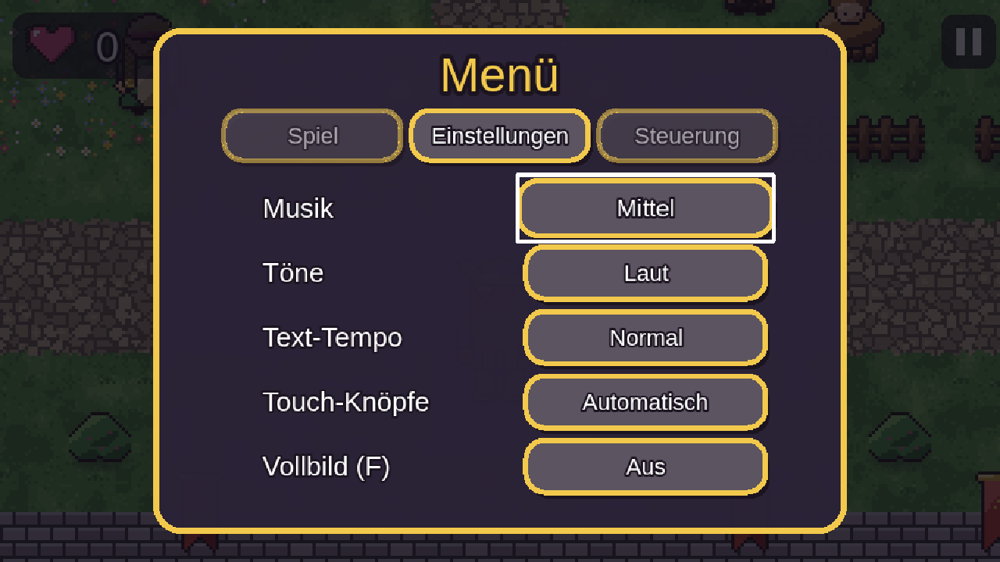

---

## 🎨 Die Figuren

Die Figuren setzt ein **Baukasten** aus Teilen zusammen (Stiefel, Rumpf, Bart, Helm …), mit allen Laufphasen.


---

## 💻 Was es braucht

| | |
|---|---|
| 🖥️ Gerät | PC, Laptop, Tablet oder Handy mit einem aktuellen Browser |
| 🎮 Optional | Ein Controller (Xbox, PlayStation, Switch Pro) wird automatisch erkannt. |
| 📦 Installation | Keine. Link öffnen und spielen. |
| 🌐 Internet | nur beim ersten Laden |
| 💰 Kosten | Keine Werbung, keine Käufe, keine Anmeldung |

---

## 🛠️ Selbst etwas ändern

| Was | Wo |
|---|---|
| Texte, Wünsche und Figuren eines Ortes | `src/levels/<ort>.js` |
| Aussehen der Figuren (Bart, Helm, Farben) | `src/grafik/figuren-liste.js` |
| Ein **neues Level** bauen | [docs/NEUES-LEVEL.md](docs/NEUES-LEVEL.md) |
| Bildergeschichten, allgemeine Texte | `src/texte/de.js` |
| Kapitel und Drehbücher | `src/levels/index.js` |

Karten werden mit Zeichen «gemalt», z. B. `T` = Tanne, `B` = Brunnen, `F` = Obstbaum, `a`–`z` = Figuren:

```
'MMMMMMMMMMMM',
'M....a.....M',
'M..B....F..M',
'M....@.....M',
'MMMMM1MMMMMM',
```

📖 **Spielanleitung** mit Steuerung und Tipps: [Wiki → Spielanleitung](https://github.com/GSB-Deleven/Game-Der_Grosse_Zwerg/wiki/Spielanleitung)

🛠️ **Technik** mit Aufbau, Drehbüchern und Tests: [Wiki → Technik](https://github.com/GSB-Deleven/Game-Der_Grosse_Zwerg/wiki/Technik)

<details>
<summary>👩‍💻 Für Entwickler</summary>

```bash
npm install
npm run dev              # http://localhost:5173/Game-Der_Grosse_Zwerg/
npm run pruefen          # prüft alle Karten auf Sackgassen
npm run build            # dist/ für GitHub Pages
npm run build:artefakt   # eine einzige HTML-Datei zum Teilen
node tests/durchlauf.mjs # spielt das ganze Spiel automatisch durch (folgt dem gelben Pfeil)
```

- **Technik:** Phaser 3 und Vite, reines JavaScript
- **Abkürzungen:** `?kapitel=4` springt direkt in ein Kapitel, `?schnell` verkürzt Wartezeiten (für Tests)

</details>

---

## 🤝 Mitmachen

| | |
|---|---|
| 💬 [Discussions](https://github.com/GSB-Deleven/Game-Der_Grosse_Zwerg/discussions) | lose Ideen und Wünsche, z. B. neue Level von Liv |
| ✅ [Issues](https://github.com/GSB-Deleven/Game-Der_Grosse_Zwerg/issues) | konkrete Aufgaben und Fehler, mit Vorlagen |
| 🗂️ [Project-Board](https://github.com/GSB-Deleven/Game-Der_Grosse_Zwerg/projects) und [Milestones](https://github.com/GSB-Deleven/Game-Der_Grosse_Zwerg/milestones) | Überblick, was als Nächstes kommt |
| 🤖 **@claude** | in einem Issue erwähnen oder Label «claude» setzen: Claude setzt die Aufgabe um und schlägt einen Pull Request vor |
| 📖 [Wiki](https://github.com/GSB-Deleven/Game-Der_Grosse_Zwerg/wiki) | alle Anleitungen an einem Ort |

---

<div align="center"><i>Wer weiss, vielleicht beschützen die zwei das Zwergenreich bis heute.</i></div>
